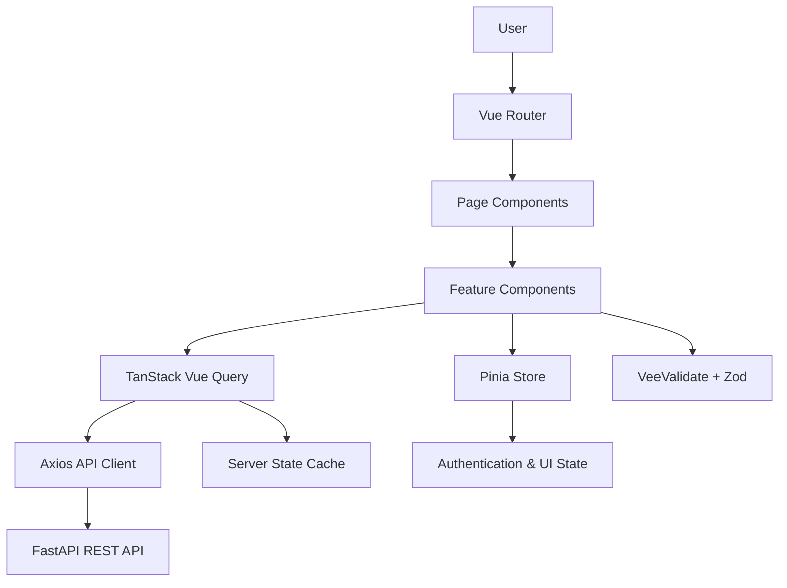

## ✨ 프론트엔드 주요 기능 (Key Frontend Features)

- **✅ 회원 및 인증**
  > 이메일 기반 회원가입·로그인 및 이메일 인증 화면  
  > JWT Access Token·Refresh Token 기반 인증 상태 관리  
  > 로그아웃, 비밀번호 재설정과 회원 탈퇴 사용자 흐름  
  > 인증 여부에 따른 보호 페이지 접근 제어

- **✅ 프로필 및 온보딩**
  > 관심 토픽, 보유·학습 기술 스택과 희망 역할 등록  
  > 참여 가능한 기간, 진행 방식 등 프로젝트 참여 조건 설정  
  > 자기소개와 포트폴리오 등록 및 프로필 완성도 표시

- **✅ 프로젝트 모집 관리**
  > 프로젝트 모집 글 작성·조회·수정·삭제 화면  
  > 토픽, 기술 스택, 모집 역할, 역할별 인원과 모집 마감일 입력  
  > 모집 중·모집 완료 등 프로젝트 상태별 화면과 사용자 액션 제어

- **✅ 프로젝트 탐색 및 검색**
  > 키워드 기반 프로젝트 검색  
  > 토픽·기술 스택·역할·진행 방식·모집 상태를 조합한 필터링  
  > 페이지네이션을 적용한 프로젝트 목록 및 상세 조회  
  > 검색 조건과 페이지 정보를 URL Query Parameter와 동기화

- **✅ 지원 및 팀 구성 관리**
  > 프로젝트 지원·취소 및 내 지원 내역 조회  
  > 모집자의 지원자 조회와 승인·거절 처리  
  > 지원 상태와 사용자 권한에 따른 버튼 및 안내 문구 제어  
  > 지원 승인 후 확정 팀원과 프로젝트 진행 상태 표시

- **✅ 관심 목록 및 활동 기록**
  > 관심 프로젝트 저장·해제 및 목록 조회  
  > 작성한 모집 글, 지원한 프로젝트와 받은 지원 현황 조회  
  > 사용자 알림과 상태별 활동 이력 표시

- **✅ 맞춤형 추천**
  > 사용자 프로필 기반 개인화 프로젝트 추천  
  > 추천 점수와 일치한 역할·토픽·기술 스택 등 추천 이유 표시  
  > 유사 프로젝트 조회와 규칙 기반 대체 결과 처리

- **✅ 입력 폼 및 오류 처리**
  > VeeValidate와 Zod 기반 입력 상태 및 검증 규칙 관리  
  > API 요청의 로딩·성공·오류·빈 결과 상태 처리  
  > 공통 오류 메시지와 재시도 사용자 흐름 제공

- **🔜 확장 기능**
  > FCM 기반 웹 푸시 알림  
  > PWA 설치와 모바일 화면 최적화  
  > 프로젝트 채팅·게시판과 일정 관리 화면

---

## ⚙️ 기술 스택 (Tech Stack)

<div align="center">

### Frontend
<p>
  
  
  
  
</p>

### State & API
<p>
  
  
  
</p>

### Form & UI
<p>
  
  
  
</p>

### Test & Quality
<p>
  
  
  
  
  
  
  
</p>

</div>

> Pinia는 인증 사용자와 전역 UI 등 클라이언트 상태를 관리합니다.<br>
> TanStack Vue Query는 프로젝트, 지원 내역, 관심 목록과 추천 결과 등 서버 상태의 조회·캐싱·동기화를 담당합니다.<br>
> E2E 테스트는 MVP 범위에서 제외하고 Vitest와 Vue Test Utils를 이용한 단위·컴포넌트 테스트에 집중합니다.

---

## 🖥️ 프론트엔드 아키텍처 (Frontend System Architecture)

SideFit 프론트엔드는 **기능 중심 구조**를 기반으로 화면, 상태, API와 검증 로직의 책임을 분리합니다.  
서버에서 조회한 데이터는 TanStack Vue Query로 관리하고, 인증 및 클라이언트 전역 상태는 Pinia로 관리합니다.



### 상태 관리 기준

| 상태 유형 | 관리 기술 | 관리 대상 |
| --- | --- | --- |
| Client State | Pinia | 인증 사용자, 인증 처리 상태, 전역 UI 상태 |
| Server State | TanStack Vue Query | 프로젝트, 지원 내역, 관심 목록, 추천 결과 |
| Form State | VeeValidate | 입력값, 오류 메시지, 제출 상태 |
| Validation | Zod | 필수값, 길이, 형식과 타입 검증 |
| URL State | Vue Router | 검색어, 필터, 페이지 번호와 정렬 조건 |

서버에서 조회한 응답을 Pinia에 중복 저장하지 않고 TanStack Vue Query의 캐시를 서버 상태의 단일 기준으로 사용합니다.

---

## 📁 프로젝트 구조 (Project Structure)

```text
📦 src
┣ 📜 main.ts                     # Vue 애플리케이션 진입점
┣ 📜 App.vue                     # 루트 컴포넌트
┣ 📂 app
┃ ┣ 📜 router.ts                # 라우트 및 Navigation Guard
┃ ┗ 📜 queryClient.ts           # TanStack Vue Query 설정
┣ 📂 assets
┃ ┗ 📜 main.css                 # Tailwind CSS와 전역 스타일
┣ 📂 components
┃ ┣ 📂 common                   # 버튼, 모달, 로딩과 상태 컴포넌트
┃ ┣ 📂 form                     # 공통 입력 및 검증 컴포넌트
┃ ┗ 📂 layout                   # Header, Navigation과 Page Layout
┣ 📂 features
┃ ┣ 📂 auth                     # 회원가입·로그인·인증
┃ ┣ 📂 profile                  # 프로필 및 온보딩
┃ ┣ 📂 projects                 # 프로젝트 조회·작성·수정
┃ ┣ 📂 applications             # 프로젝트 지원·승인·거절
┃ ┣ 📂 bookmarks                # 관심 프로젝트
┃ ┣ 📂 recommendations          # 맞춤형·유사 프로젝트 추천
┃ ┗ 📂 notifications            # 알림과 수신 설정
┣ 📂 pages
┃ ┣ 📂 auth                     # 인증 관련 페이지
┃ ┣ 📂 projects                 # 프로젝트 목록·상세·작성 페이지
┃ ┣ 📂 recommendations          # 추천 페이지
┃ ┗ 📂 mypage                   # 마이페이지
┣ 📂 services
┃ ┣ 📜 apiClient.ts             # Axios 인스턴스와 인터셉터
┃ ┗ 📜 endpoints.ts             # API Endpoint 상수
┣ 📂 stores
┃ ┗ 📜 auth.ts                  # 인증 사용자와 클라이언트 상태
┣ 📂 schemas
┃ ┣ 📜 auth.ts                  # 인증 입력 검증
┃ ┣ 📜 profile.ts               # 프로필 입력 검증
┃ ┗ 📜 project.ts               # 프로젝트 입력 검증
┣ 📂 types
┃ ┣ 📜 api.ts                   # 공통 API 응답 및 오류 타입
┃ ┗ 📜 domain.ts                # 도메인 타입
┣ 📂 composables                # 공통 Vue Composable
┣ 📂 constants                  # 상태값과 공통 상수
┣ 📂 utils                      # 포맷 변환과 공통 함수
┗ 📂 tests                      # 단위·컴포넌트 테스트
```

각 기능 폴더는 필요에 따라 다음 파일을 포함합니다.

```text
api.ts          # 기능별 API 요청 함수
queries.ts      # useQuery와 useMutation 정의
components/     # 기능 전용 컴포넌트
types.ts        # 기능 전용 요청·응답 타입
schemas.ts      # 기능 전용 Zod 검증 스키마
utils.ts        # 기능 내부 변환 및 표시 로직
```

---

## 🔐 인증 구조 (Authentication)

SideFit 프론트엔드는 FastAPI 백엔드의 JWT 인증 API와 연동합니다.

```text
1. 사용자가 이메일과 비밀번호를 입력하여 로그인을 요청합니다.
2. VeeValidate와 Zod가 입력값의 형식과 필수값을 검증합니다.
3. Axios를 통해 FastAPI 로그인 API를 호출합니다.
4. 인증에 성공하면 사용자 인증 상태를 Pinia에 반영합니다.
5. Vue Router Navigation Guard가 보호된 페이지의 접근 가능 여부를 확인합니다.
6. 보호 API 요청에는 Axios 인터셉터를 통해 인증 정보를 전달합니다.
7. Access Token 만료 시 Refresh Token을 통한 갱신 또는 로그인 화면 이동을 처리합니다.
8. 로그아웃 시 인증 상태와 서버 상태 캐시를 초기화합니다.
```

### 보안 원칙

- 비밀번호와 토큰 등 민감정보를 브라우저 콘솔에 출력하지 않습니다.
- 인증 정보 저장 방식은 XSS와 CSRF 위험을 고려하여 결정합니다.
- 프로젝트 수정·삭제와 지원 승인·거절 버튼은 사용자 권한에 따라 노출합니다.
- 프론트엔드 권한 제어와 별개로 백엔드에서 소유권과 역할을 다시 검증합니다.
- API 오류 응답에 포함된 내부 구현 정보는 사용자 화면에 그대로 노출하지 않습니다.

---

## 🔄 서버 상태 및 API 처리 (Server State & API)

### 조회 처리

```text
Page Component
→ Feature Query
→ TanStack Vue Query
→ Axios API Client
→ FastAPI REST API
```

### 변경 처리

```text
사용자 입력
→ VeeValidate·Zod 검증
→ useMutation 실행
→ FastAPI 변경 API 호출
→ 성공 시 관련 Query Key 무효화
→ 최신 서버 데이터 재조회
```

### API 계층 원칙

- Axios Base URL과 공통 Header는 하나의 API Client에서 관리합니다.
- 기능별 API 함수는 HTTP 요청과 응답 변환만 담당합니다.
- 조회 요청은 `useQuery`, 생성·수정·삭제 요청은 `useMutation`으로 관리합니다.
- 변경 성공 후 연관된 Query Key를 무효화하여 화면 데이터를 동기화합니다.
- 로딩, 오류, 빈 결과와 재시도 상태를 공통 컴포넌트로 제공합니다.
- FastAPI 공통 오류 응답을 프론트엔드 오류 모델로 변환합니다.

---

## 🧪 테스트 및 품질 관리 (Test & Quality)

### 테스트 대상

- 회원가입·로그인 입력 폼 검증
- 프로필 및 프로젝트 작성 폼 검증
- 인증 여부에 따른 Vue Router 접근 제어
- Pinia 인증 상태의 변경과 초기화
- 지원 상태별 버튼과 안내 문구 표시
- 관심 프로젝트 저장·해제 상호작용
- API 로딩·성공·오류·빈 결과 상태
- 추천 프로젝트와 추천 이유 렌더링
- Mutation 성공 이후 Query Cache 무효화

### 커밋 단계 품질 검사

```text
git commit
→ Husky pre-commit hook
→ lint-staged
→ 변경된 Vue·TypeScript 파일 ESLint 검사
→ Prettier 형식 검사
→ 검사 실패 시 커밋 중단
```

### GitHub Actions

```text
의존성 설치
→ TypeScript 타입 검사
→ ESLint 정적 분석
→ Vitest 단위·컴포넌트 테스트
→ Vite 운영 빌드
```

---

## 🚀 실행 방법 (Getting Started)

### 요구 환경

- Node.js 20 이상
- npm 10 이상

### 프로젝트 실행

```bash
git clone https://github.com/sidefit12/sidefit12-frontend.git
cd sidefit12-frontend

npm install
npm run dev
```

### 주요 명령어

```bash
npm run dev          # 개발 서버 실행
npm run build        # TypeScript 검사 및 운영 빌드
npm run preview      # 운영 빌드 결과 미리보기
npm run lint         # ESLint 검사
npm run format       # Prettier 포맷 적용
npm run test         # Vitest Watch Mode 실행
npm run test:run     # Vitest 단일 실행
```

> 실제 명령어는 프로젝트의 `package.json`에 등록된 스크립트를 기준으로 사용합니다.

---

## 🔧 환경 변수 (Environment Variables)

프로젝트 루트에 `.env.local` 파일을 생성합니다.

```env
VITE_API_BASE_URL=http://localhost:8000
```

| 환경 변수 | 설명 |
| --- | --- |
| `VITE_API_BASE_URL` | FastAPI 백엔드 API 기본 주소 |

환경 변수 파일은 Git에 커밋하지 않으며 공개 가능한 예시는 `.env.example`에서 관리합니다.

---

## 👨‍💻 개발자 소개 (Developer)

<table align="center">
  <tr>
    <td align="center" width="220">
      <a href="https://github.com/WhiteBin-bin">
        
        <br/>
        <b>백현빈</b>
      </a>
      <br/>
      Project Lead · Frontend
      <br/>
      Architecture · API Integration
    </td>
  </tr>
</table>

<br/>

| 이름 | 담당 역할 |
| --- | --- |
| 백현빈 | 서비스 기획 및 PM, Vue 프론트엔드 아키텍처, 인증·프로필·프로젝트·지원·추천 화면, 상태 관리, API 연동, 테스트 자동화와 CI 환경 구성 |

---

## 🌿 개발 및 협업 방식 (Development Workflow)

### 명세 기반 개발

기능 명세서와 API 명세서를 기준으로 화면, 입력값, 정상 흐름과 예외 흐름을 구현합니다.

API 경로나 요청·응답 형식이 변경되는 경우 구현 코드와 TypeScript 타입보다 명세를 먼저 수정합니다.

### 이슈 단위 작업 관리

모든 작업은 GitHub Issue로 정의하고 작업 목적, 화면 범위, 완료 조건과 관련 명세를 기록합니다.

### Pull Request 기반 변경 관리

기능별 브랜치에서 작업한 뒤 Pull Request를 통해 기준 브랜치에 병합합니다.

Pull Request에는 구현 화면, API 연동 여부, 테스트 결과와 확인 방법을 작성합니다.

### 자동화된 품질 검증

Husky와 lint-staged를 사용하여 커밋 전에 변경된 Vue·TypeScript 파일을 검사합니다.

GitHub Actions에서는 TypeScript 타입 검사, ESLint, Vitest와 Vite 운영 빌드를 자동으로 수행합니다.

### 상태와 API 계약 관리

Pinia와 TanStack Vue Query의 책임을 분리하고 동일한 서버 데이터를 여러 상태 저장소에 중복 저장하지 않습니다.

API 변경 시 기능 명세, API 명세, TypeScript 타입과 Query Key에 미치는 영향을 함께 검토합니다.

---

## 📝 커밋 메시지 규칙 (Conventional Commits)

```text
feat: 프로젝트 목록 화면 구현
fix: 지원 상태별 버튼 노출 오류 수정
refactor: 인증 API 요청 모듈 분리
test: 모집 글 작성 폼 검증 테스트 추가
style: 프로젝트 카드 UI 정리
docs: 프론트엔드 실행 방법 수정
chore: ESLint와 Husky 설정 추가
```

---

## 🔗 관련 저장소 (Related Repositories)

- 조직 소개: [sidefit12/.github](https://github.com/sidefit12/.github)
- 백엔드: [sidefit12-backend](https://github.com/sidefit12/sidefit12-backend)
- 데이터 모델링: [sidefit12-data-modeling](https://github.com/sidefit12/sidefit12-data-modeling)

---
